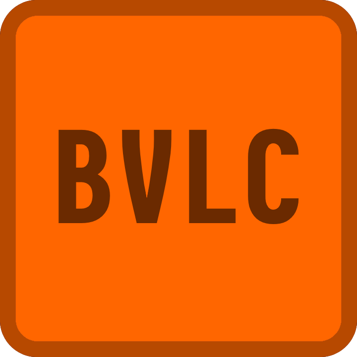

<p align="center">

</p>

> [!CAUTION]
> THIS PROJECT ONLY JUST STARTED! NONE OF ADVERTISED FUNCTIONS ARE WORKING!

> [!WARNING]
> This is absolutely not production ready this is only hobbyist project

# Better VLC

Is a simple C++ ffmpeg video player

## Dependencies

[VLC SDK](https://download.videolan.org/pub/videolan/vlc)
[BuildIt](https://github.com/BUGTree1/JustBuildIt)

## Quick Start

```console
$ make
$ ./bin/bvlc
```
